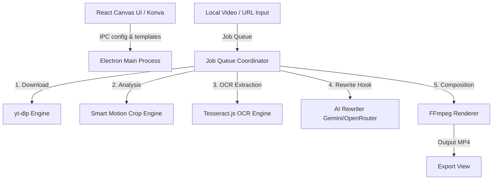

# ReelEditor

ReelEditor is a desktop application built on Electron, React, and TypeScript that automates the process of reframing, branding, and rewriting landscape videos into vertical 9:16 clips (Reels, Shorts, TikToks).

It combines batch downloading, automatic motion-aware cropping, OCR headline extraction, and LLM-powered rewrite hooks into a single offline/online workflow.

## 📥 Download

Pre-compiled installers for Windows (`.exe`) are available on the [Releases](https://github.com/sachinpal11/reeleditor-2/releases/latest) page.

---

## Architecture Overview



ReelEditor is organized as a clean-architecture monorepo separating UI and system processes:
- **Renderer Process (React + Tailwind CSS + Konva)**: A drag-and-drop template editor to design the video frame layout, logo placement, watermark positions, and headline typography.
- **Main Process (Electron + Node.js)**: Runs the system operations, external processes, and background worker queues.
- **External Binaries Pipeline**: Orchestrates `yt-dlp` for media fetching, `ffmpeg` and `ffprobe` for frame extraction and video compilation, and `sharp` for fast pixel-level canvas operations.

---

## Core Features

### 🚀 Smart Motion Crop Engine
Instead of basic center cropping, ReelEditor analyzes video frames using a motion-variance algorithm. It extracts keyframes, resizes them, and calculates pixel-level variance over time using `sharp`. The crop window dynamically shifts to center on the region containing the highest motion/action.

### 📝 Hybrid OCR & AI Hook Pipeline
- **Targeted OCR**: The engine extracts the video's original headline by masking out the active video area and running Tesseract OCR only on the top header portion of the frames.
- **LLM Refinement**: The extracted text is sent to an AI Rewriter supporting **Gemini** and **OpenRouter** (or a local fallback engine) to rewrite the headline into multiple styles (e.g., *Viral*, *Curiosity*, *Short*, or *Question* hooks).

### 🎨 Visual Canvas Template Editor
Customize and save reusable vertical layouts using an interactive editor powered by `react-konva`:
- Set custom brand colors, fonts, sizes, and font-weights.
- Position the video window, logo, and watermark.
- Highlight specific words dynamically in the headline (e.g., Bold or Brand styles).

### ⚙️ Concurrent Job Coordinator
A robust queue handles heavy system operations concurrently. Check on real-time task logs, pause, resume, or cancel jobs as they run through their lifecycle steps:
`Waiting` ➔ `Downloading` ➔ `Cropping` ➔ `OCR` ➔ `Rewriting` ➔ `Rendering` ➔ `Completed`.

---

## Prerequisites

ReelEditor requires a few external CLI utilities installed on your host system:

1. **FFmpeg & FFprobe**: Required for video frame extraction, cropping, and composition. Ensure `ffmpeg` and `ffprobe` are in your system PATH, or specify their paths in the application's Settings page.
2. **yt-dlp**: Required for downloading video URLs.
3. **Tesseract Language Data**: Ensure the English training package `eng.traineddata` remains in the root folder of the project for OCR capability.

---

## Getting Started

### 1. Installation
Clone the repository and install the dependencies:
```bash
npm install
```

### 2. Local Development
Launch the Electron application in hot-reload development mode:
```bash
npm run dev
```

### 3. Production Bundling
Build and package the application installer for your target OS:
```bash
# Windows
npm run build:win

# macOS
npm run build:mac

# Linux
npm run build:linux
```

---

## Configuration & Usage

Open the **Settings** panel in the application to configure:
- **Paths**: Set custom paths for `ffmpeg`, `ffprobe`, and `yt-dlp` if they aren't globally available.
- **AI Keys**: Add API keys for Google Gemini or OpenRouter, and choose your preferred LLM model.
- **yt-dlp Cookies**: Configure a cookies source (browser profile or cookie file) to prevent extraction blocks or bypass age verification on YouTube or Instagram.
